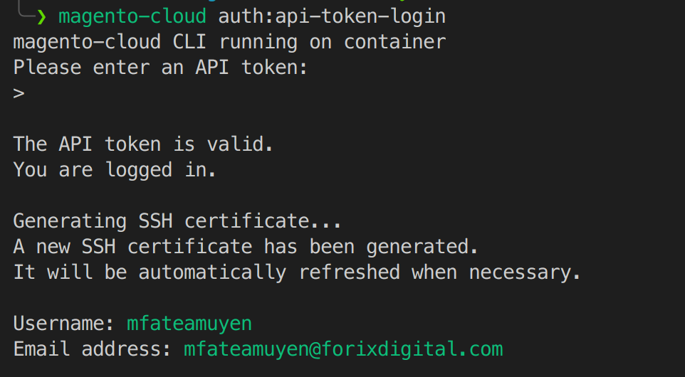
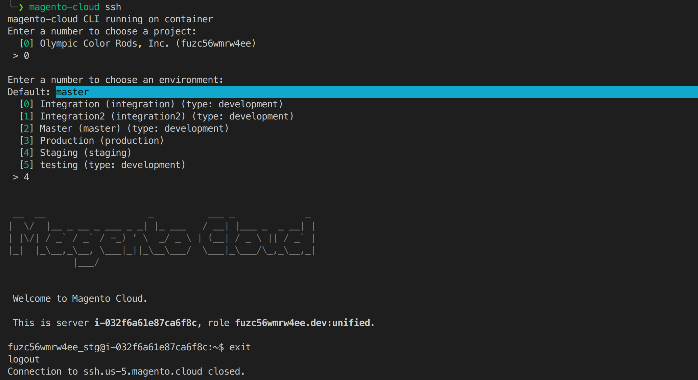

## MAGENTO CLOUD CLI

- Go to path source Magento project
  - Example: `cd ~/Site/freshmagento/html`

- Using command `magento-cloud` cli to access Magento cloud
  - Example: `magento-cloud list|ssh|auth:api-token-login`

- Example to connect Magento cloud:
  - `magento-cloud auth:api-token-login`

*** input token Magento cloud

  - `magento-cloud ssh`

