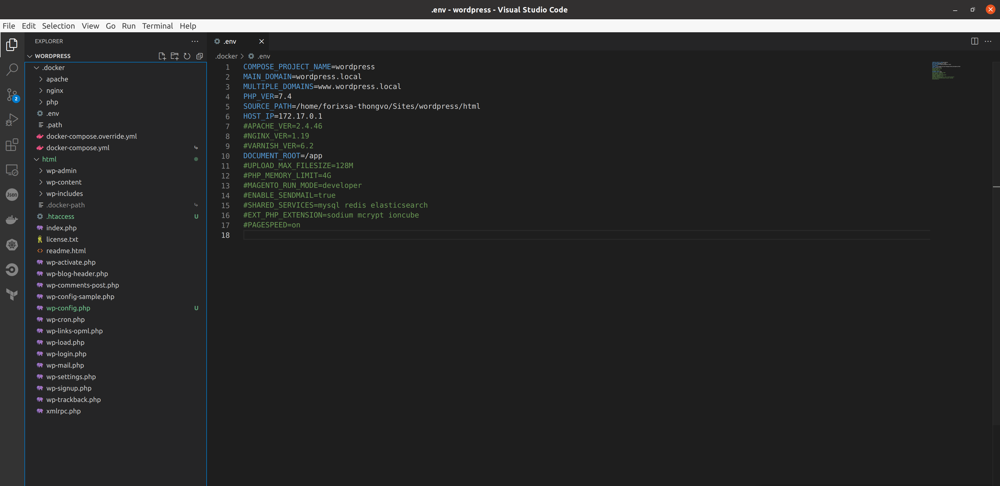
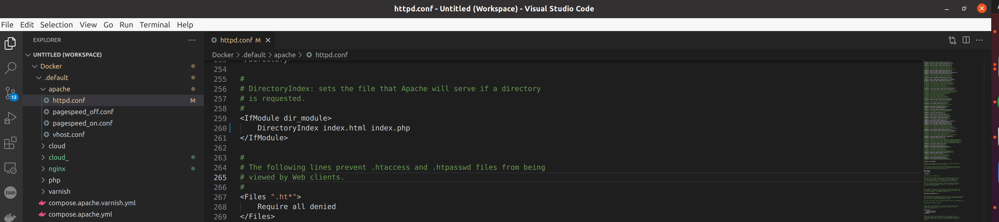
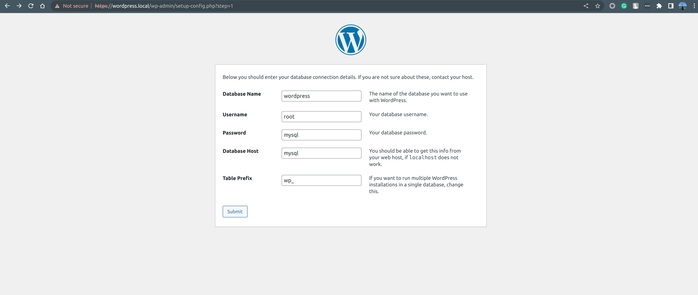
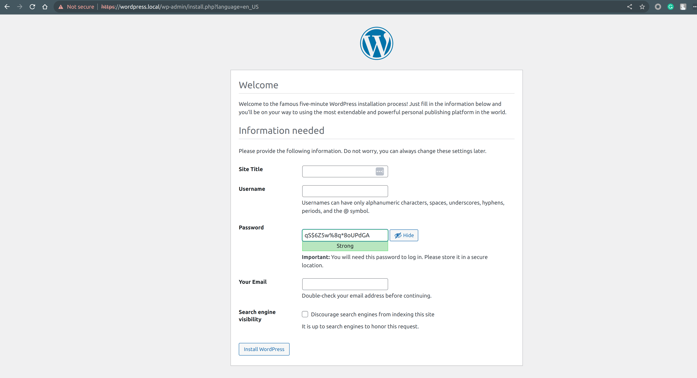
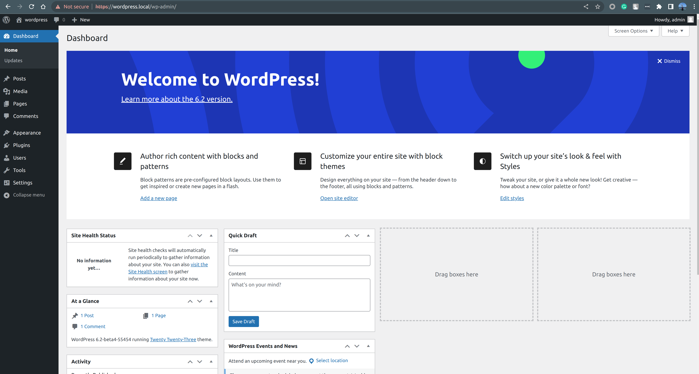
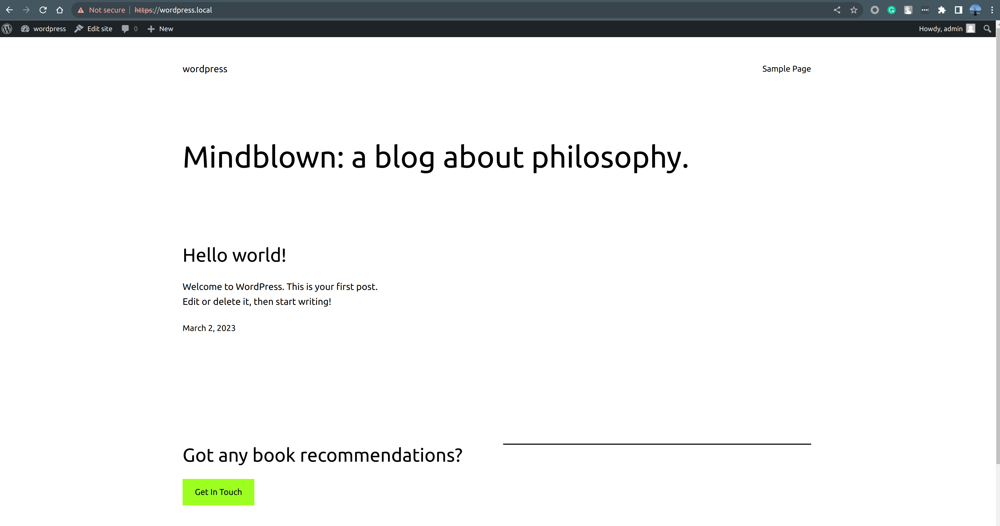

# CREATE NEW SITE FRESH WORDPRESS

## 1. Create database
 
 `docker exec -it mysql /bin/bash`

 `mysql -uroot -pmysql`

`CREATE DATABASE wordpress;`

`show databases;`

## 2. Create project folder name on structure Docker

- Clone source code wordpress

`mkdir -p ~/Sites/wordpress/html`

`cd ~/Sites/wordpress/html`

`git clone https://github.com/WordPress/WordPress.git .`

- Init setup project

`cd ~/Sites/wordpress/`

`fr-docker-init`

- Edit file .env docker

`cd ~/Sites/wordpress/.docker`

edit path `DOCUMENT_ROOT=/app`

Example file env

- Edit file config apache `~/Docker/.default/apache`

| `<IfModule dir_module>
    DirectoryIndex index.html index.php
  </IfModule>`

Example file config apache

- Start apache up

`cd ~/Sites/wordpress/html`

`apache up -d`

## 3. Start project wordpress

Go to website with url: `https://wordpress.local/wp-admin/`

