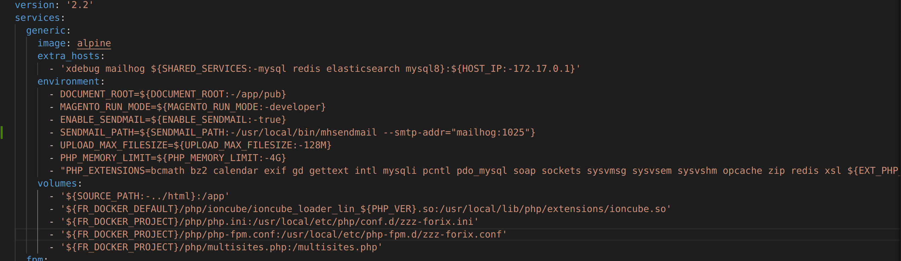
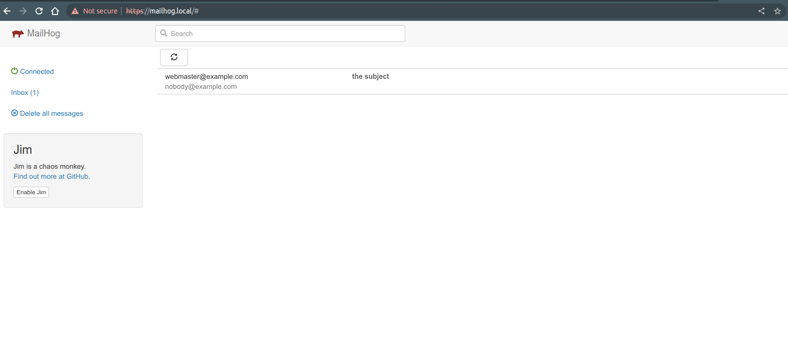
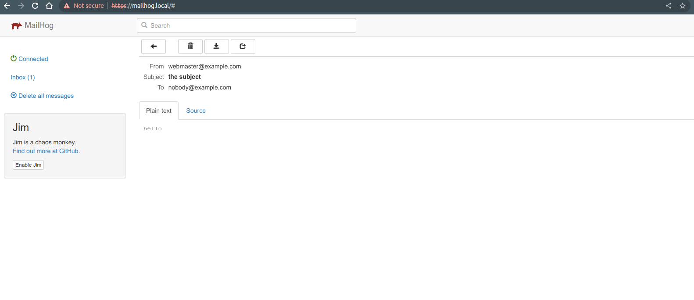

## FIX ISSUE SENDMAIL FUNCTION

- Update file `~/Docker/.default/docker-compose.yml` add line on below

    `- SENDMAIL_PATH=${SENDMAIL_PATH:-/usr/local/bin/mhsendmail --smtp-addr="mailhog:1025"}`

- Prepare code test sendmail php on path `~/Sites/"project"/html/test_sendmail.php`

    `<?php
    $to      = 'nobody@example.com';
    $subject = 'the subject';
    $message = 'hello';
    $headers = 'From: webmaster@example.com' . "\r\n" .
        'Reply-To: webmaster@example.com' . "\r\n" .
        'X-Mailer: PHP/';

    mail($to, $subject, $message, $headers);
    ?>`

- Try to sendmail function php

    `php test_sendmail.php`

- Check mail go to website `https://mailhog.local/`

